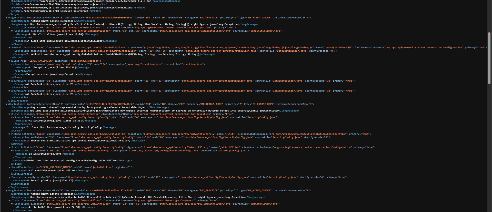
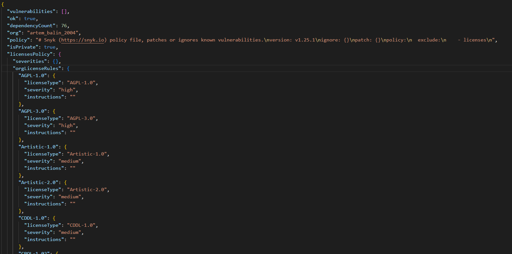

# Информационная безопасность. Работа 1. P3412. Балин А. А.

## Разработка защищенного REST API с интеграцией в CI/CD (Spring Boot 3)

REST‑сервис с аутентификацией по JWT, примером CRUD‑сущности `Item` и демонстрацией базовых мер защиты от SQL‑инъекций и XSS.

### Технологии
- **Spring Boot 3.5**, **Spring Security 6.5**, **Spring Data JPA (Hibernate)**
- **PostgreSQL**
- **JWT**: `jjwt 0.11.5` (HS256)
- **OWASP Java Encoder** для экранирования вывода (XSS)
- **BCrypt** для хеширования паролей

## Быстрый старт
1) Установить JDK 17 и PostgreSQL. Создать БД (по умолчанию `secure_api`).

2) Настроить переменные окружения (можно через файл `.env` в корне модуля `secure-api`, он подхватывается автоматически):
```
DB_URL=jdbc:postgresql://localhost:5432/secure_api
DB_USERNAME=postgres
DB_PASSWORD=postgres

JWT_SECRET=some-long-string
JWT_TTL_SECONDS=3600

# Инициализация пользователя при старте
INIT_USERNAME=admin
INIT_PASSWORD=admin_password
INIT_EMAIL=admin@example.com
```

3) Запуск:
```
cd secure-api
./mvnw.cmd spring-boot:run
```

По умолчанию приложение слушает `http://localhost:8080`.

## Переменные окружения
- **DB_URL**: JDBC‑URL Postgres. По умолчанию `jdbc:postgresql://localhost:5432/secure_api`.
- **DB_USERNAME/DB_PASSWORD**: учётные данные БД. По умолчанию `postgres`/`postgres`.
- **JWT_SECRET**: секрет для подписи JWT (HS256). Поддерживается сырой текст или Base64.
- **JWT_TTL_SECONDS**: время жизни access‑токена в секундах. По умолчанию `3600`.
- **JPA_DDL_AUTO**: режим схемы Hibernate, по умолчанию `update` (см. `application.properties`).
- **INIT_USERNAME / INIT_PASSWORD / INIT_EMAIL**: при старте создаёт пользователя, если его ещё нет.

## API
Все эндпоинты (кроме логина) требуют заголовок `Authorization: Bearer <JWT>`.

### Аутентификация
- **POST** `/auth/login`
  - Тело запроса:
    ```json
    {
      "username": "admin",
      "password": "admin_password"
    }
    ```
  - Успех (200 OK):
    ```json
    {
      "token": "<jwt>",
      "tokenType": "Bearer"
    }
    ```
  - Ошибка (401 Unauthorized): `{"error":"Invalid credentials"}`

Пример запроса:
```bash
curl -X POST http://localhost:8080/auth/login \
  -H "Content-Type: application/json" \
  -d '{"username":"admin","password":"admin_password"}'
```

### Демо‑данные
- **GET** `/api/data` — возвращает текущего пользователя и пример списка элементов.
  - Пример:
    ```bash
    curl http://localhost:8080/api/data \
      -H "Authorization: Bearer <jwt>"
    ```
  - Ответ (200 OK):
    ```json
    {
      "currentUser": "admin",
      "items": [
        {"id": 1, "title": "Hello"},
        {"id": 2, "title": "World"}
      ]
    }
    ```

### Items
Базовые операции со сущностью `Item` (поле `title`, максимум 255 символов, не пустое).

- **GET** `/api/items` — список элементов.
  - Пример:
    ```bash
    curl http://localhost:8080/api/items \
      -H "Authorization: Bearer <jwt>"
    ```

- **POST** `/api/items`
  - Тело запроса:
    ```json
    { "title": "My <b>safe</b> item" }
    ```
  - Успех (200 OK):
    ```json
    {
      "createdBy": "admin",
      "item": { "id": 123, "title": "My &lt;b&gt;safe&lt;/b&gt; item" }
    }
    ```
  - Возможные ошибки: 400 (валидация), 401 (нет/неверный токен)
  - Пример:
    ```bash
    curl -X POST http://localhost:8080/api/items \
      -H "Authorization: Bearer <jwt>" \
      -H "Content-Type: application/json" \
      -d '{"title": "My <b>safe</b> item"}'
    ```

## Реализованные меры защиты

### Аутентификация и управление сессией
- **JWT Bearer**: Stateless‑аутентификация через заголовок `Authorization: Bearer <jwt>`.
- **Security policy**: открыт только `/auth/login`; все остальные запросы требуют аутентификации (`SecurityConfig`).
- **Подпись и проверка токенов**: `HS256` с секретом из `JWT_SECRET`; время жизни задаётся `JWT_TTL_SECONDS` (`JwtService`).
- **Фильтрация запросов**: `JwtAuthFilter` извлекает токен, валидирует, находит пользователя и устанавливает `SecurityContext`. При отсутствии/некорректности токена запрос не проходит авторизацию (ответ 401).
- **Пароли**: хранятся только в виде хеша `BCrypt` (`PasswordEncoder` в `AppSecurityConfig`).
- **Stateless‑режим**: `SessionCreationPolicy.STATELESS`, серверные сессии не используются.

### Защита от SQL‑инъекций (SQLi)
- **ORM и параметризация**: доступ к данным — через Spring Data JPA (`UserRepository`, `ItemRepository`) и типовые методы (`findByUsername`, `save`, `findAll`). Hibernate использует подготовленные выражения и параметризацию, что предотвращает классические SQL‑инъекции.
- **Отсутствие конкатенации SQL**: в проекте нет ручной сборки SQL‑строк из пользовательского ввода.
- **Валидация данных**: ограничения `@NotBlank`, `@Size`, `@Email` уменьшают поверхность атак и аномальные нагрузки.
- **Конфигурация JPA**: `spring.jpa.open-in-view=false` снижает риск неявного ленивого доступа к данным вне контролируемых границ.

### Защита от XSS
- **Экранирование вывода**: перед отправкой наружу поля типа текста (например, `Item.title`) кодируются через `OWASP Java Encoder` (`Sanitizer.forHtml`). Это превращает потенциально опасные символы (`<`, `>`, `&`, `"`, `\'`) в безопасные HTML‑сущности, предотвращая выполнение внедрённого кода при HTML‑рендеринге на стороне клиента.
- **JSON‑ответы**: API возвращает JSON; даже так, используется принцип «encode on output», что безопасно при последующем отображении в HTML/DOM.

### Прочие аспекты
- **Инициализация пользователя**: через `INIT_USERNAME/INIT_PASSWORD/INIT_EMAIL` при старте (см. `DataInitializer`).
- **Логирование SQL**: `spring.jpa.show-sql=false` по умолчанию, чтобы не утекали чувствительные данные в логи.
- **Статическая типизация и валидация**: Jakarta Bean Validation (`@Valid`) автоматически возвращает 400 при нарушении ограничений.

## Структура модулей
- `auth` — логин и выдача JWT.
- `security` — `JwtAuthFilter`, `JwtService` и конфигурация безопасности.
- `user` — сущность пользователя и сервис создания с BCrypt.
- `item` — сущность, репозиторий и контроллер (пример CRUD + XSS‑защита вывода).
- `api` — демонстрационный эндпоинт `/api/data`.
- `config` — конфигурации приложения, `PasswordEncoder`, инициализация данных.
- `util` — утилиты экранирования вывода.

## Известные ограничения (выполнение которых не входит в задание)
- Нет обновления/удаления `Item` (только create/list).
- Нет ролей и прав (все аутентифицированные пользователи равны).
- Нет механизма отзывов токенов и refresh‑токенов.

## Отчёты SAST/SCA

Изначально было найдено 6 уязвимостей с помощью `SpotBugs`:



Файлы с отчётами: [самый первый отчёт](./docs/spotbugsXml(0).xml), [отчёт после устранения пары уязвимостей](./docs/spotbugsXml(1).xml), [финальный отчёт без ошибок](./docs/spotbugsXml(2).xml)

Уязвимости в зависимостях и сторонних библиотеках производилось с помощью `Snyk`:



[Файл с отчётом](./docs/snyk-report.json)

[Ссылка на последний* успешный action](https://github.com/zapadniy-ZOV/IB-1/actions/runs/17829620927)

*Последний успешный action, связанный с настройкой самой утилиты и изменением кода, не обновления в README. Все jobs после изменений в README никак не влияют на успешный запуск пайплайна.
